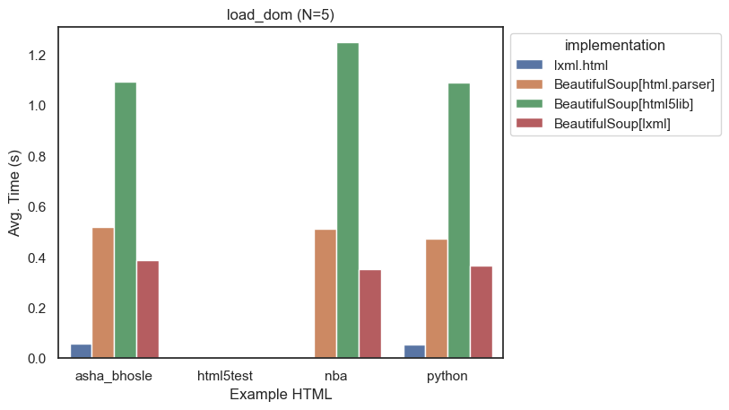
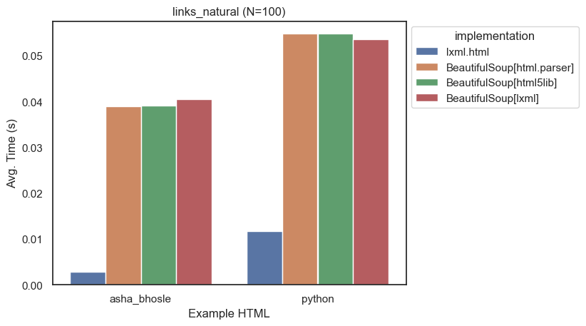
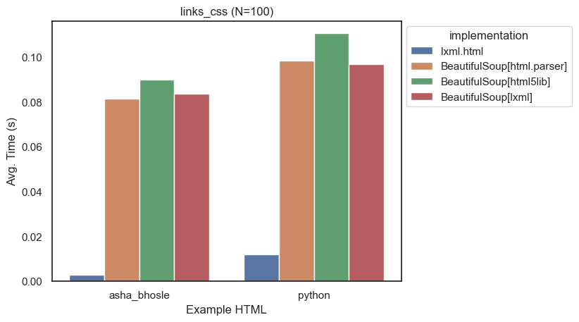

# Comparing BeautifulSoup and lxml

The two main libraries for parsing HTML in Python are [Beautiful Soup](https://www.crummy.com/software/BeautifulSoup/) and [lxml](http://lxml.de/).

Beautiful Soup is not actually a parser in itself, but a wrapper around a number of different parsers. It's [documentation](https://www.crummy.com/software/BeautifulSoup/bs4/doc/#installing-a-parser) explains how to pick a parser.  The default parser is [html.parser](https://docs.python.org/3/library/html.parser.html), which is part of the Python standard library. You can also use [lxml](http://lxml.de/) or `html5lib`.

The conventional wisdom about these parsers is roughly:

| Parser | Language | Speed | How Lenient? |
| --- | --- | --- | --- |
| html.parser | C | Slow | Moderately |
| lxml | C | Fast | Moderately |
| html5lib | Python | Slowest | Extremely |

We'll take a look at real world examples to see how true this is.  
Also "lenient" is tough to define, so we'll look at how each parser handles some common HTML errors and see how big of a factor leniency plays.

We'll compare these along several dimensions:

* Speed
* Leniency
* Ease of Use
* Features
* Memory Usage

## Test Data & Environment

For the speed and memory usage tests I grabbed four sample pages:

* [Python Documentation Full Index](https://docs.python.org/3/genindex-all.html) - A fairly large page with lots of links.
* [List of 2021-22 NBA Transactions](https://en.wikipedia.org/wiki/List_of_2021%E2%80%9322_NBA_season_transactions) - A very large Wikipedia page with a huge table.
* [List of Hindi songs recorded by Asha Bhosle](https://en.wikipedia.org/wiki/List_of_Hindi_songs_recorded_by_Asha_Bhosle) - At the time of writing, the largest Wikipedia page.
* [HTML5 Test Page](https://html5test.com/index.html) - A moderately sized page with lots of HTML5 features.

All benchmarks were evaluated on my MacBook Pro (2021) with an Apple M1 Processor running Python 3.10.7.

## Speed Comparison

While it is generally true that scrapers are limited by the speed of the connection to the target website, the speed of different parsers can have a significant impact on the performance of your scraper.

Or perhaps you are working on a complex scraper, and decided it is a good idea to cache copies of the pages locally and run your scraper against those. This will allow you to test your scraper without having to wait for the target website to respond.
If you are using this strategy, you will quickly find that the speed of your scraper is now limited by the speed of your parser.

To test the speed of the parsers, I wrote a benchmarking script which you can see [here](#TODO).

### Benchmark #1 - Parsing HTML

The first benchmark simply parses the HTML of the four pages using each of the parsers.

lxml:
```python
root = lxml.html.fromstring(html)
```
BeautifulSoup:
```python
root = BeautifulSoup(html, 'lxml')
  # or 'html.parser' or 'html5lib'
```



This first test highlighted two issues, first was that the html5test page was so small it didn't even register on the graph.  
Second, something weird is going on with lxml.html and the NBA example, it kept giving outliers.  We'll return to that later when we look at leniency.


Taking a look at a zoomed in graph with just html5test, it is clear the relative speeds are about the same between the different test pages.

At this point in the experiment I decided to just use asha_bhosle and python.  Additional pages only cluttered up the graphs, and two felt like enough to show the degree of consistency between pages.


As you can see looking at this final graph, lxml is significantly faster than the others.  Even when BeautifulSoup is using lxml as the parser, it is about 10x slower than using lxml directly. html5lib is about **20x slower** than lxml on parse_dom.

Relative Speeds:

| Parser | Speed |
| --- | --- |
| lxml | 1.0 |
| BeautifulSoup (lxml) | 7x |
| BeautifulSoup (html.parser) | 9x |
| BeautifulSoup (html5lib) | 20x |

### Benchmark #2 - Extracting Links

This benchmark uses each library to find all `<a>` tags with an `href` attribute.  This is a common task for scrapers. 

lxml:

```python
# in lxml, XPath is the native way to do this
links = root.xpath('//a[@href]')
```

BeautifulSoup:

```python
# in BeautifulSoup, you'd typically use find_all
links = root.find_all('a', href=True)
```

The results here are similar to the first benchmark, lxml is significantly faster than the others:



I added code to count the number of links found as well, to make sure the two implementations were equivalent.  This surfaced more issues with lxml's parsing of the NBA page.  (Heavy-handed foreshadowing of future content.) For the other pages, lxml was about 6x faster than all BeautifulSoup implementations.

Furthermore, the three BeautifulSoup implementations are virtually identical in speed. This was interesting, it looks like BeautifulSoup might be using its own implementation of `find_all` instead of taking advantage of lxml's faster alternatives.

### Benchmark #3 - Extracting Links (CSS)

I figured it'd be good to take a look at another way of getting the same data. This time we'll use CSS Selectors to find all `<a>` tags with an `href` attribute.

For lxml to support this feature, it needs the [cssselect](https://pypi.org/project/cssselect/) library installed.

lxml:

```python
links = root.cssselect('a[href]')
```

BeautifulSoup:

```python
# select all a tags with an href attribute
links = root.select('a[href]')
```

It is clear at this point, `lxml` is probably going to win every benchmark. 



 It is about 12x faster than BeautifulSoup's CSS Selector implementation.

Furthermore, CSS Selectors are just as fast in lxml as XPath which is good news if you prefer using them.

TODO: talk about implementation

### Benchmark #4 - Counting Elements

For this benchmark we'll walk the DOM tree and count the number of elements.  DOM Traversal is just about the worst way to get data out of HTML, but sometimes it is necessary.

There are multiple ways to walk the entire tree, but I figured I'd do it naively.  I'll recursively walk the tree and count the number of elements encountered.

My first attempt looked like this:

lxml:

```python
  elements = []
  def count(element):
      elements.append(element)
      for child in element.getchildren():
          count(child)
  count(root)
```

BeautifulSoup:

```python
  elements = []
  def count(element):
      elements.append(element)
      for child in element.children:
          count(child)
  count(root)
```

But when comparing the results, I saw this

| Parser | Example | Elements |
| --- | --- | --- |
| lxml | asha_bhosle | 38458 |
| lxml | python | 34944 |
| BeautifulSoup\[html.parser] |  asha_bhosle |   97,786
| BeautifulSoup\[html.parser]  |      python |   87,949
| BeautifulSoup\[html5lib]   | asha_bhosle  |  97,783
| BeautifulSoup\[html5lib]  |     python   | 87,973
| BeautifulSoup\[lxml]  | asha_bhosle   | 97,785
| BeautifulSoup\[lxml]  |     python   | 87,947

This was no good, lxml found less than half the number of elements that BeautifulSoup did.  Furthermore, BeautifulSoup wasn't consistent between parsers.

Using other methods like `iter()` or `descendants` didn't help either.  I eventually figured out that lxml was only counting elements that had children.  This is because `getchildren()` only returns elements that have children, while `children` returns all elements.

### Benchmark #5 - Extracting Text

Finally, we'll use each parser's built in text extraction function to extract the text from the pages.

lxml:

```python
text = root.text_content()
```

BeautifulSoup:

```python
text = root.get_text()
```
