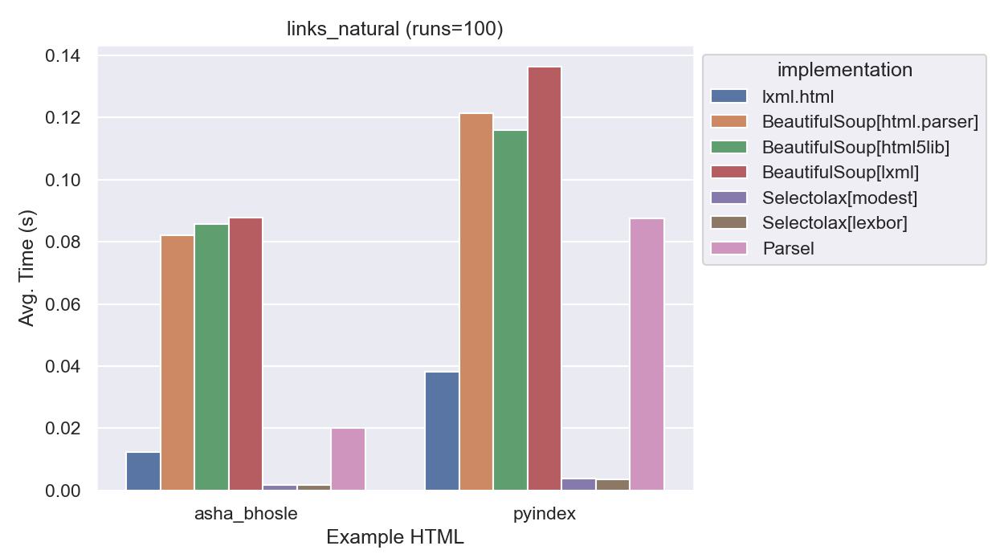
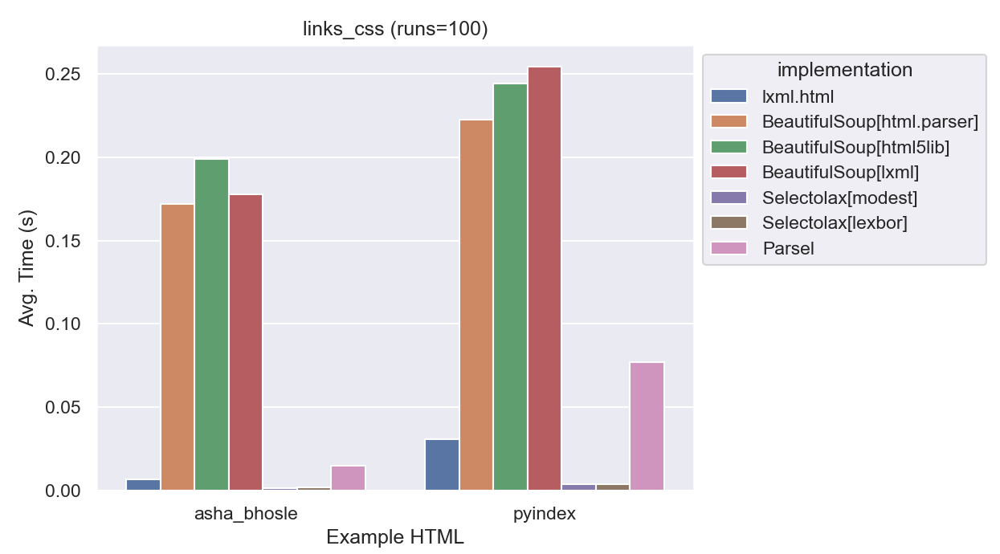

# Comparing BeautifulSoup and lxml (Part 1: Performance)

TODO https://beautiful-soup-4.readthedocs.io/en/latest/#improving-performance
TODO add other libraries

When people talk about libraries for writing
web scrapers, the first thing they usually mention are the libraries for parsing HTML.

In Python that means [Beautiful Soup](https://www.crummy.com/software/BeautifulSoup/) and [lxml](http://lxml.de/).

Beautiful Soup is not actually a parser in itself, but a wrapper around a number of different parsers. It's [documentation](https://www.crummy.com/software/BeautifulSoup/bs4/doc/#installing-a-parser) explains how to pick a parser and offers some conventional wisdom about which you should pick.  The default parser is [html.parser](https://docs.python.org/3/library/html.parser.html), which is part of the Python standard library. You can also use [lxml](http://lxml.de/) or `html5lib`.

The conventional wisdom about these parsers is roughly:

| Parser | Speed | Flexibility |
| --- | --- | --- |
| html.parser | Slow | Moderately |
| lxml | Fast | Moderately |
| html5lib | Slowest | Most |

I realized despite years of writing scrapers, I didn't know how well this wisdom had held up. Python has gotten a lot faster, perhaps BeautifulSoup was more competitive.

Also, I've always found the "flexibility" part of the conventional wisdom to be a bit vague.  What does flexible really mean?  I've scraped [a lot of terrible HTML](https://gitub.com/openstates/openstates-scrapers/) with `lxml`, would it have been easier with `html5lib`?

I'm going to take a look at these libraries among a couple of dimensions:

* Performance (Speed & Memory)
* Flexibility
* Ease of Use & Features
* Memory Usage

## Speed Comparison

To be clear, speed is rarely the most important part of choosing a scraping library. We'll start there because it is the most straightforward to measure and will give us an opportunity to see some sample code for each.

While it is generally true that scrapers are limited by the speed of the connection to the target website, the speed of different parsers can have a significant impact on the performance of your scraper.

### Benchmark #1 - Parsing HTML

The initial parse of the HTML is the most expensive part of the scraping process.  This benchmark measures the time it takes to parse the HTML using each library.

#### Code

lxml.html:
```python
root = lxml.html.fromstring(html)
```
BeautifulSoup:
```python
root = BeautifulSoup(html, 'lxml')
  # or 'html.parser' or 'html5lib'
```

#### Results


As you can see looking at this final graph, lxml is significantly faster than the others.  Even when BeautifulSoup is using lxml as the parser, it is about 10x slower than using lxml directly. html5lib is about **20x slower** than lxml on parse_dom.

Relative Speeds:

| Parser | Speed |
| --- | --- |
| lxml | 1.0 |
| BeautifulSoup (lxml) | 7x |
| BeautifulSoup (html.parser) | 9x |
| BeautifulSoup (html5lib) | 20x |

#### Aside: Smaller Pages

In an earlier draft of the benchmarks, I used a smaller page to test the parsers.  The results were similar, but not as dramatic:


Taking a look at a graph with just html5test, it is clear the relative speeds are about the same between the different test pages.

Parsing this page is so much faster than the larger more complex pages used for the rest of the tests that it basically disappeared on all graphs.

### Benchmark #2 - Extracting Links

This benchmark uses each library to find all `<a>` tags with an `href` attribute.  This is a common task for scrapers. 

#### Code

lxml.html:

```python
# in lxml, XPath is the native way to do this
links = root.xpath('//a[@href]')
```

BeautifulSoup:

```python
# in BeautifulSoup, you'd typically use find_all
links = root.find_all('a', href=True)
```

#### Results



The results here are similar to the first benchmark, lxml is significantly faster than the others:

Furthermore, the three BeautifulSoup implementations are virtually identical in speed. This was interesting, it looks like BeautifulSoup is likely using its own implementation of `find_all` instead of taking advantage of lxml's faster alternatives.

### Benchmark #3 - Extracting Links (CSS)

I wanted to take a look at another way of getting the same data. This time we'll use CSS Selectors to find all `<a>` tags with an `href` attribute.

#### Code

Note: For lxml to support this feature, it needs the [cssselect](https://pypi.org/project/cssselect/) library installed.

lxml.html:

```python
links = root.cssselect('a[href]')
```

BeautifulSoup:

```python
# select all a tags with an href attribute
links = root.select('a[href]')
```

#### Results



lxml.html once again was a clear winner.  It is about 12x faster than BeautifulSoup's CSS Selector implementation.

Furthermore, CSS Selectors are just as fast in lxml as XPath which is good news if you prefer using them.

### Benchmark #4 - Counting Elements

For this benchmark we'll walk the DOM tree and count the number of elements.  DOM Traversal is just about the worst way to get data out of HTML, but sometimes it is necessary.

#### Code 

There are multiple ways to walk the entire tree, but I figured I'd do it naively.  I'll recursively walk the tree and count the number of elements encountered.

My first attempt looked like this:

lxml.html:

```python
  elements = []
  def count(element):
      elements.append(element)
      for child in element.getchildren():
          count(child)
  count(root)
```

BeautifulSoup:

```python
  elements = []
  def count(element):
      elements.append(element)
      for child in element.children:
          count(child)
  count(root)
```

But when comparing the results to make sure the implementations were equivalent, I saw this:

| example     |   BeautifulSoup[html.parser] |   BeautifulSoup[html5lib] |   BeautifulSoup[lxml] |   lxml.html |
|:------------|-----------------------------:|--------------------------:|----------------------:|------------:|
| asha_bhosle |                       97,786 |                    97,783 |                97,785 |      38,458 |
| pyindex     |                       87,949 |                    87,973 |                87,947 |      34,944 |

This was no good, lxml found less than half the number of elements that BeautifulSoup did.  Furthermore, BeautifulSoup wasn't consistent between parsers.

After taking a look at a parsed tree, I realized that BeautifulSoup's `.children` returns text nodes. For parity, I altered the code to check if the element was an HTML tag, and if it wasn't, it would skip it.

BeautifulSoup (revised):

```python
  elements = []
  def count(element):
      if isinstance(element, bs4.Tag):
        elements.append(element)
        for child in element.children:
            count(child)
  count(root)
```

With this, the counts lined up much better:

| example     |   BeautifulSoup[html.parser] |   BeautifulSoup[html5lib] |   BeautifulSoup[lxml] |   lxml.html |
|:------------|-----------------------------:|--------------------------:|----------------------:|------------:|
| asha_bhosle |                       38,454 |                    38,454 |                38,454 |      38,453 |
| pyindex     |                       34,945 |                    34,973 |                34,945 |      34,944 |


There are still small differences, especially with html5lib.  We'll explore what kinds of differences exist when we look at the flexibility of the parsers.

#### Results


Wow! BeautifulSoup wins, it is about 30% faster to do this traversal with BeautifulSoup. The difference here is of course much smaller, but I'd assumed we wouldn't see BeautifulSoup win any of these benchmarks by this point.

### Benchmark #5 - Extracting Text

For this benchmark, we'll use each parser's built in text extraction function to extract the text from the pages.

These methods are used to extract all of the text from a block of HTML. This is useful for things like extracting large blocks of plain text with some markup.

For this benchmark in particular, we'll extract text from each of the `<ul>` tags on the page.

#### Code

lxml.html: 

```python
uls = root.xpath('//ul')
text = "".join([ul.text_content() for ul in uls])
```

BeautifulSoup:

```python
uls = root.find_all('ul')
text = "".join([ul.get_text() for ul in uls])
```

#### Results


lxml.html averaged 7x faster.

It is worth noting that the lengths here differed as well:

| example     |   BeautifulSoup[html.parser] |   BeautifulSoup[html5lib] |   BeautifulSoup[lxml] |   lxml.html |
|:------------|-----------------------------:|--------------------------:|----------------------:|------------:|
| asha_bhosle |                         2270 |                      2282 |                  2270 |        2282 |
| pyindex     |                       565339 |                    740069 |                565339 |      740069 |

For the pyindex example it is notable that html5lib and lxml.html are finding about 200,000 more characters than the other parsers.
It's also quite strange that BeautifulSoup's lxml parser is finding the same number of characters as the html.parser, and not `lxml.html`.
It'll be worth revisiting this when we get to evaluating flexibility.

### Benchmark #6 - "Real World"

So far we've been looking at very simple benchmarks of common methods. It seems clear that lxml.html is the fastest, but how much would that speed matter in a real world scenario?

To simulate a real world scrape, we'll compose a scrape from the pieces we've already done:

1) Parse the [Python documentation index](https://docs.python.org/3/genindex-all.html) as a start page.
2) For each link on the page, parse the page the link points to.  (Note: The index contains many links to the same page, we'll parse each page each time it is encountered to simulate having many more actual pages.)
3) On each of those pages, we'll perform 3 tasks:
  a) Extract the text from the root element.
  b) Count the number of elements on the page by walking the DOM.
  c) Count the spans on the page using CSS selectors.

This is a fair simulacrum of the work that a real scrape would do. All in all our mock scrape hits 11,824 pages, a moderately sized scrape.

And of course, as before, all of this will be done using local files so no actual network requests will be made. An initial run will warm an in-memory cache, so disk I/O will not be a factor either.

The results were interesting, after a sample run to warm the cache, the results looked like:

| Parser                      | Time (s) | Pages/s |
| --------------------------- | -------- | --------|
| lxml                        | 114  | 104 |
| BeautifulSoup\[html.parser] | 824  | 14 |
| BeautifulSoup\[html5lib]    | 1,728 | 7 |
| BeautifulSoup\[lxml]        | 623  | 19 |

For a moderate-sized scrape like this one, lxml.html is about 7x faster than BeautifulSoup's html.parser.

That said, notice that in each case, the number of pages per second is higher than 1.  A common wait time between requests is 1 second. This means that in each case, we'd be spending more time waiting for requests than actually parsing pages.

So does this mean the speed of a parser doesn't matter? Not at all.

What if you were able to make 20 requests per second?  At that point, only lxml.html could keep up.

Let's take a look at how this plays out as we increase the number of requests per second:


So, as we increase the number of requests per second, lxml.html is the only parser that can keep up with our hypothetical scrape.

## Memory Comparison

Finally, let's take a look at how much memory each parser uses while handling the following files:

| Example | Bytes | Tags | 
| ------- | ----- | ---- |
| asha_bhosle | 1,132,673 | ~38,450 |
| pyindex | 1,683,137 | ~34,950 |
| html5test | 18,992 | 218 |

This is somewhat difficult to measure, as the memory usage of an object is not easily accessible from Python.  I used [memray](https://github.com/bloomberg/memray) to measure a sample piece of code that loaded each parser and parsed the sample pages.  To compare the memory usage between complex pages and simple pages, the sample code also loaded the html5test page 100 times.


One thing to note is that the memory usage seems to be correlated to complexity (i.e. number of tags), which makes sense.

Again, lxml.html is the clear winner here, using less than half the memory of the other parsers.

## Conclusion

One one hand, performance isn't going to make or break your scrape.  If you're scraping a small number of pages, or are dealing with a slow site or rate limit, the difference between the fastest and slowest parsers is going to be negligible.

In practice, the real payoffs of using a faster parser are going to be felt the most during development of larger scrapers. If you're using a local cache while scraping (and I hope you are), your requests per second are nearly limitless.  This means that the speed of your parser is going to be the limiting factor in how fast you can iterate on your scrape.

In a 1,000 page scrape from cache of pages similar to our final benchmark, a full trial run would take less than 15 seconds while a full trial run with `html5lib.parser` would take nearly 3 minutes.  At 10,000 pages the difference between the shortest and longest is almost half an hour.

Memory usage might also matter to you, if you are running your scraper on a small VPS or have unusually complex pages, memory usage could be a factor and that's another place where `lxml.html` shines.

Next time, we'll take a look at how flexible each parser is, and how that affects your scrape.

## Notes

All benchmarks were evaluated on a 2021 MacBook Pro with an Apple M1 Pro.

Python: 3.10.7 (installed via pyenv)
BeautifulSoup: 4.11.1
lxml: 4.9.1
cssselect: 1.2.0

For the performance tests I grabbed four sample pages:

* [Python Documentation Full Index](https://docs.python.org/3/genindex-all.html) - A fairly large page with lots of links.
* [List of 2021-22 NBA Transactions](https://en.wikipedia.org/wiki/List_of_2021%E2%80%9322_NBA_season_transactions) - A very large Wikipedia page with a huge table.
* [List of Hindi songs recorded by Asha Bhosle](https://en.wikipedia.org/wiki/List_of_Hindi_songs_recorded_by_Asha_Bhosle) - At the time of writing, the largest Wikipedia page.
* [HTML5 Test Page](https://html5test.com/index.html) - A moderately sized page with lots of HTML5 features.

All source code for these experiments is in [scraping-experiments](https://github.com/jamesturk/scraping-experiments/).