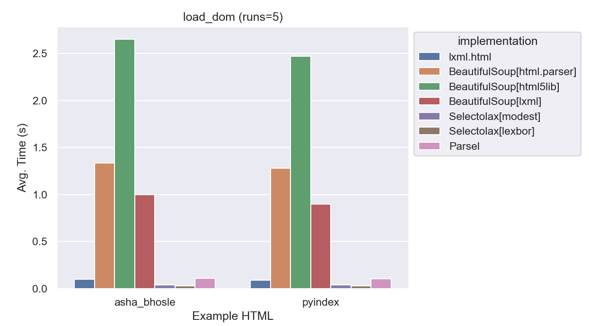
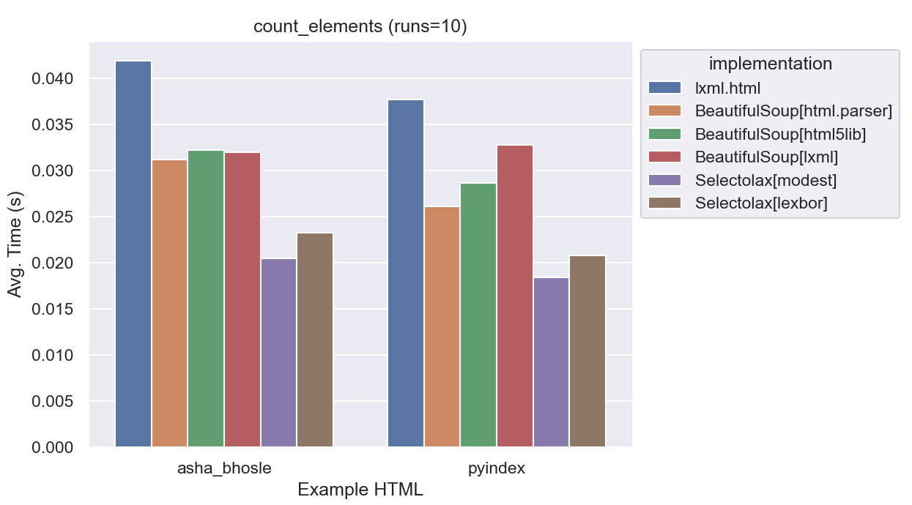
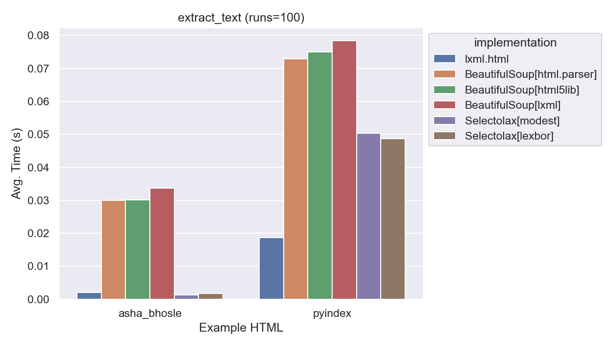
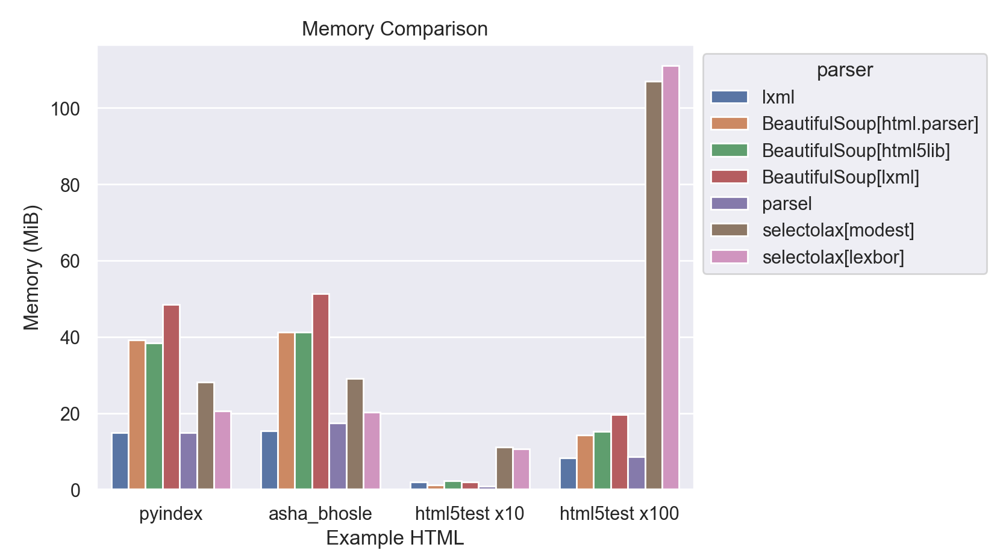

# Comparing BeautifulSoup and lxml

The two main libraries for parsing HTML in Python are [Beautiful Soup](https://www.crummy.com/software/BeautifulSoup/) and [lxml](http://lxml.de/).

Beautiful Soup is not actually a parser in itself, but a wrapper around a number of different parsers. It's [documentation](https://www.crummy.com/software/BeautifulSoup/bs4/doc/#installing-a-parser) explains how to pick a parser.  The default parser is [html.parser](https://docs.python.org/3/library/html.parser.html), which is part of the Python standard library. You can also use [lxml](http://lxml.de/) or `html5lib`.

The conventional wisdom about these parsers is roughly:

| Parser | Language | Speed | How Lenient? |
| --- | --- | --- | --- |
| html.parser | part of CPython | Slow | Moderately |
| lxml | C | Fast | Moderately |
| html5lib | Python | Slowest | Extremely |

We'll take a look at real world examples to see how true this is.  
Also "lenient" is tough to define, so we'll look at how each parser handles some common HTML errors and see how big of a factor leniency plays.

We'll compare these along several dimensions:

* Speed
* Leniency
* Ease of Use
* Features
* Memory Usage

## Test Data & Environment

For the speed and memory usage tests I grabbed four sample pages:

* [Python Documentation Full Index](https://docs.python.org/3/genindex-all.html) - A fairly large page with lots of links.
* [List of 2021-22 NBA Transactions](https://en.wikipedia.org/wiki/List_of_2021%E2%80%9322_NBA_season_transactions) - A very large Wikipedia page with a huge table.
* [List of Hindi songs recorded by Asha Bhosle](https://en.wikipedia.org/wiki/List_of_Hindi_songs_recorded_by_Asha_Bhosle) - At the time of writing, the largest Wikipedia page.
* [HTML5 Test Page](https://html5test.com/index.html) - A moderately sized page with lots of HTML5 features.

All benchmarks were evaluated on my MacBook Pro (2021) with an Apple M1 Processor running Python 3.10.7.

## Speed Comparison

While it is generally true that scrapers are limited by the speed of the connection to the target website, the speed of different parsers can have a significant impact on the performance of your scraper.

Or perhaps you are working on a complex scraper, and decided it is a good idea to cache copies of the pages locally and run your scraper against those. This will allow you to test your scraper without having to wait for the target website to respond.
If you are using this strategy, you will quickly find that the speed of your scraper is now limited by the speed of your parser.

To test the speed of the parsers, I wrote a benchmarking script which you can see [here](#TODO).

### Benchmark #1 - Parsing HTML

The first benchmark simply parses the HTML of the four pages using each of the parsers.

lxml:
```python
root = lxml.html.fromstring(html)
```
BeautifulSoup:
```python
root = BeautifulSoup(html, 'lxml')
  # or 'html.parser' or 'html5lib'
```


This first test highlighted two issues, first was that the html5test page was so small it didn't even register on the graph.  
Second, something weird is going on with lxml.html and the NBA example, it kept giving outliers.  We'll return to that later when we look at leniency.


Taking a look at a zoomed in graph with just html5test, it is clear the relative speeds are about the same between the different test pages.

At this point in the experiment I decided to just use asha_bhosle and python.  Additional pages only cluttered up the graphs, and two felt like enough to show the degree of consistency between pages.



As you can see looking at this final graph, lxml is significantly faster than the others.  Even when BeautifulSoup is using lxml as the parser, it is about 10x slower than using lxml directly. html5lib is about **20x slower** than lxml on parse_dom.

Relative Speeds:

| Parser | Speed |
| --- | --- |
| lxml | 1.0 |
| BeautifulSoup (lxml) | 7x |
| BeautifulSoup (html.parser) | 9x |
| BeautifulSoup (html5lib) | 20x |

### Benchmark #2 - Extracting Links

This benchmark uses each library to find all `<a>` tags with an `href` attribute.  This is a common task for scrapers. 

lxml:

```python
# in lxml, XPath is the native way to do this
links = root.xpath('//a[@href]')
```

BeautifulSoup:

```python
# in BeautifulSoup, you'd typically use find_all
links = root.find_all('a', href=True)
```

The results here are similar to the first benchmark, lxml is significantly faster than the others:


I added code to count the number of links found as well, to make sure the two implementations were equivalent.  This surfaced more issues with lxml's parsing of the NBA page.  (Heavy-handed foreshadowing of future content.) For the other pages, lxml was about 6x faster than all BeautifulSoup implementations.

Furthermore, the three BeautifulSoup implementations are virtually identical in speed. This was interesting, it looks like BeautifulSoup might be using its own implementation of `find_all` instead of taking advantage of lxml's faster alternatives.

### Benchmark #3 - Extracting Links (CSS)

I figured it'd be good to take a look at another way of getting the same data. This time we'll use CSS Selectors to find all `<a>` tags with an `href` attribute.

For lxml to support this feature, it needs the [cssselect](https://pypi.org/project/cssselect/) library installed.

lxml:

```python
links = root.cssselect('a[href]')
```

BeautifulSoup:

```python
# select all a tags with an href attribute
links = root.select('a[href]')
```

lxml.html once again was a clear winner:


 It is about 12x faster than BeautifulSoup's CSS Selector implementation.

Furthermore, CSS Selectors are just as fast in lxml as XPath which is good news if you prefer using them.

TODO: talk about implementation

### Benchmark #4 - Counting Elements

For this benchmark we'll walk the DOM tree and count the number of elements.  DOM Traversal is just about the worst way to get data out of HTML, but sometimes it is necessary.

There are multiple ways to walk the entire tree, but I figured I'd do it naively.  I'll recursively walk the tree and count the number of elements encountered.

My first attempt looked like this:

lxml:

```python
  elements = []
  def count(element):
      elements.append(element)
      for child in element.getchildren():
          count(child)
  count(root)
```

BeautifulSoup:

```python
  elements = []
  def count(element):
      elements.append(element)
      for child in element.children:
          count(child)
  count(root)
```

But when comparing the results, I saw this

| Parser                      | Example      | Elements |
| --------------------------- | ------------ | ------ |
| lxml                        | asha_bhosle  | 38,458 |
| lxml                        | python       | 34,944 |
| BeautifulSoup\[html.parser] | asha_bhosle  | 97,786
| BeautifulSoup\[html.parser] | python       | 87,949
| BeautifulSoup\[html5lib]    | asha_bhosle  | 97,783
| BeautifulSoup\[html5lib]    | python       | 87,973
| BeautifulSoup\[lxml]        | asha_bhosle  | 97,785
| BeautifulSoup\[lxml]        | python       | 87,947

This was no good, lxml found less than half the number of elements that BeautifulSoup did.  Furthermore, BeautifulSoup wasn't consistent between parsers.

After taking a look at a parsed tree, I realized that BeautifulSoup's `.children` returns text nodes. For parity, I altered the code to check if the element was an HTML tag, and if it wasn't, it would skip it.

BeautifulSoup (revised):

```python
  elements = []
  def count(element):
      if isinstance(element, bs4.Tag):
        elements.append(element)
        for child in element.children:
            count(child)
  count(root)
```

With this, the counts lined up much better:

| example     |   BeautifulSoup[html.parser] |   BeautifulSoup[html5lib] |   BeautifulSoup[lxml] |   lxml.html |
|:------------|-----------------------------:|--------------------------:|----------------------:|------------:|
| asha_bhosle |                       38,454 |                    38,454 |                38,454 |      38,453 |
| python      |                       34,945 |                    34,973 |                34,945 |      34,944 |


There are still small differences, especially with html5lib.  I assume we'll revisit this when we get to evaluating leniency.

How about the performance?



Wow! BeautifulSoup won, it is about 30% faster to do this traversal with BeautifulSoup. The difference here is of course much smaller, but I'd assumed we wouldn't see BeautifulSoup win any of these benchmarks by this point.

### Benchmark #5 - Extracting Text

Finally, we'll use each parser's built in text extraction function to extract the text from the pages.

These methods are typically used to extract all of the text from a block of HTML. This is useful for things like searching or summarizing the content.

For benchmarking purposes I figured I'd just extract the text from the root element.

lxml.html: 

```python
uls = root.xpath('//ul')
text = "".join([ul.text_content() for ul in uls])
```

BeautifulSoup:

```python
uls = root.find_all('ul')
text = "".join([ul.get_text() for ul in uls])
```

The lengths here differed as well:

| example     |   BeautifulSoup[html.parser] |   BeautifulSoup[html5lib] |   BeautifulSoup[lxml] |   lxml.html |
|:------------|-----------------------------:|--------------------------:|----------------------:|------------:|
| asha_bhosle |                         2270 |                      2282 |                  2270 |        2282 |
| python      |                       565339 |                    740069 |                565339 |      740069 |

For the `python` example it is notable that html5lib and lxml.html are finding about 200,000 more characters than the other parsers.
It's also quite strange that BeautifulSoup's lxml parser is finding the same number of characters as the html.parser, and not `lxml.html`.
It'll be worth revisiting this when we get to evaluating leniency.

As for how the speed compared, lxml.html once again was the fastest:



lxml.html averaged 7x faster.

### Benchmark #6 - "Real World Scrape"

So far we've been looking at very simple benchmarks of common methods. It seems clear that lxml.html is the fastest, but how much would that speed matter in a real world scenario?

To simulate a real world scrape, I figured we could treat the benchmarks as a series of steps in a scrape.

Our fake scrape will look like this:

1) Parse the [Python documentation index](https://docs.python.org/3/genindex-all.html) as a start page.
2) For each link on the page, parse the page the link points to.  (Note: The index contains many links to the same page, we'll parse each page each time it is encountered to simulate having many more actual pages.)
3) On each of those pages, we'll perform 3 tasks:
  a) Extract the text from the root element.
  b) Count the number of elements on the page by walking the DOM.
  c) Count the spans on the page using CSS selectors.

This is a decent simulacrum of the work that a real scrape would do.  All in all our mock scrape hits 11,824 pages, a moderately sized scrape.

And of course, as before, all of this will be done using local files so no actual network requests will be made. An initial run will warm an in-memory cache, so disk I/O will not be a factor either.

This code is in [benchmark6.py](#TODO).

The results were interesting, after a sample run to warm the cache, the results looked like:

| Parser                      | Time (s) | Pages/s |
| --------------------------- | -------- | --------|
| lxml                        | 114  | 104 |
| BeautifulSoup\[html.parser] | 824  | 14 |
| BeautifulSoup\[html5lib]    | 1,728 | 7 |
| BeautifulSoup\[lxml]        | 623  | 19 |

For a moderate-sized scrape like this one, lxml.html is about 7x faster than BeautifulSoup's html.parser.

That said, notice that in each case, the number of pages per second is higher than 1.  A common wait time between requests is 1 second. This means that in each case, we'd be spending more time waiting for requests than actually parsing pages.

So does this mean the speed of a parser doesn't matter? Not at all.

What if you were able to make 20 requests per second?  At that point, only lxml.html could keep up.

Let's take a look at how this plays out as we increase the number of requests per second:


So, as we increase the number of requests per second, lxml.html is the only parser that can keep up with our hypothetical scrape.

### Memory Comparison

Finally, let's take a look at how much memory each parser uses while handling the following files:

| Example | Bytes | Tags | 
| ------- | ----- | ---- |
| asha_bhosle | 1,132,673 | |
| python | 1,683,137 | |
| html5test | 18,992 | |

This is somewhat difficult to measure, as the memory usage of an object is not easily accessible from Python.  I used [memray](https://github.com/bloomberg/memray) to measure a sample piece of code that loaded each parser and parsed the sample pages.  To compare the memory usage between complex pages and simple pages, the sample code also loaded the html5test page 100 times.



One thing to note is that the memory usage seems to be correlated to complexity (i.e. number of tags), which makes sense.

Again, lxml.html is the clear winner here, using less than half the memory of the other parsers.

## Conclusion

One one hand, performance isn't going to make or break your scrape.  If you're scraping a small number of pages, or are dealing with a slow site or rate limit, the difference between the fastest and slowest parsers is going to be negligible.

In practice, the real payoffs of using a faster parser are going to be felt the most during development of larger scrapers. If you're using a local cache while scraping, your requests per second are nearly limitless.  This means that the speed of your parser is going to be the limiting factor in how fast you can iterate on your scrape.

In a 1,000 page scrape from cache of pages similar to our final benchmark, a full trial run would take less than 15 seconds while a full trial run with `html5lib.parser` would take nearly 3 minutes.  At 10,000 pages the difference between the shortest and longest is almost half an hour.

Memory usage might also matter to you, if you are running your scraper on a small VPS or have unusually complex pages, memory usage could be a factor and that's another place where `lxml.html` shines.

Next time, we'll take a look at how lenient each parser is, and how that affects your scrape.